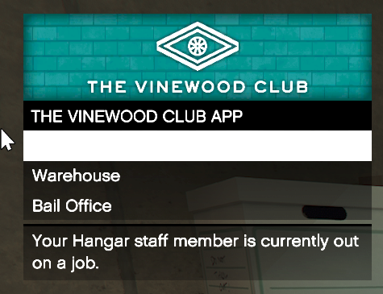

# 격납고 파견 결과 판독

2026-10-08 01:30 KST 실제 $25,000 결제 후 화면이다. 메뉴 영역만 보존했다.



일반 및 흰 글자 OCR 모두 다음 다섯 줄만 반환했다. Hangar 행의 이름은 누락됐다.

```text
THE VINEWOOD CLUB APP
Warehouse
Bail Office
Your Hangar staff member is currently out
on a job.
```

기존 코드는 Hangar 이름이 없으면 결과 문구를 판독하지 않아 60초 뒤 실패했다. 수정본은 직원 목록 구조, 첫 행 선택과 전체 조달 중 문구를 함께 확인한다. 이 조건으로 준비 상태나 결제 대상을 추정하지 않는다.
